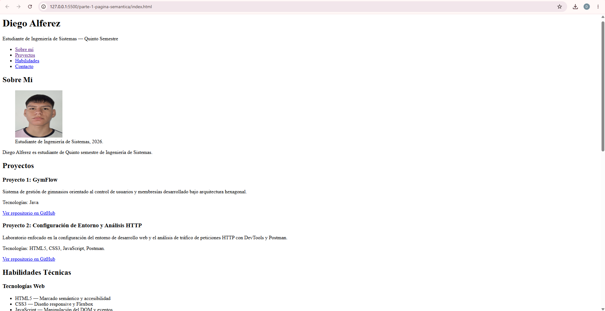
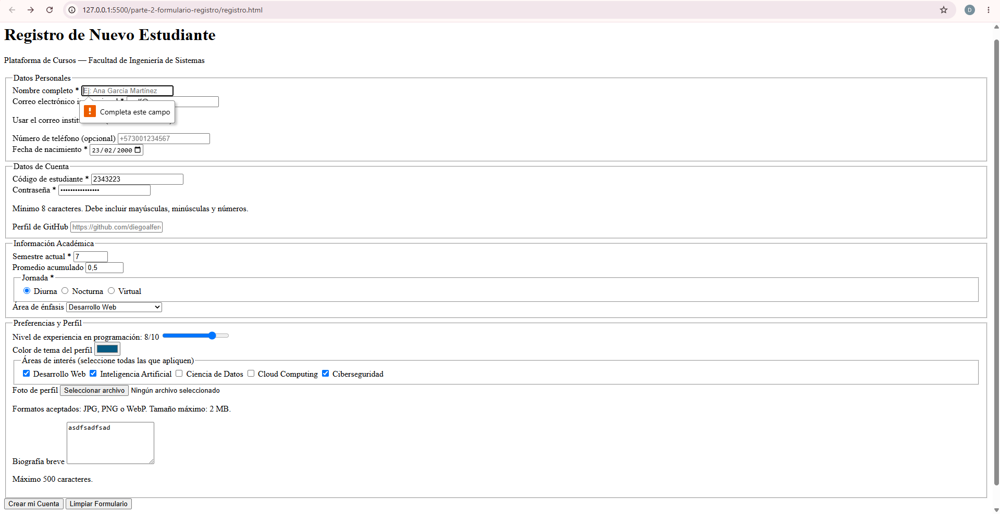

# Post-contenido — Unidad 2: HTML5 Básico

## Descripción
Repositorio del laboratorio de la Unidad 2 de Programación Web (Ingeniería de Sistemas — UFPS, Cúcuta). Contiene dos partes desarrolladas con HTML5 nativo: una página de portafolio personal estructurada con etiquetas semánticas (`parte-1-pagina-semantica/`) y un formulario de registro universitario con validación nativa (`parte-2-formulario-registro/`).

## Parte 1 — Página semántica
Página de portafolio personal que implementa `header`, `nav`, `main`, `section`, `article`, `aside` y `footer`, con listas `ul`/`ol`/`dl`, un bloque de multimedia (audio con transcripción) con su recurso de accesibilidad asociado, una sección de preguntas frecuentes con `details`/`summary`, y meta tags de SEO. Ver `parte-1-pagina-semantica/`.

## Parte 2 — Formulario de registro
Formulario de registro universitario con más de 10 tipos de input HTML5 (`text`, `email`, `password`, `tel`, `url`, `date`, `number`, `range`, `color`, `file`, `checkbox`, `radio`, `hidden`, `textarea`, `select`) agrupados en `fieldset`, con validación nativa y atributos ARIA. Ver `parte-2-formulario-registro/`.

## Decisiones de diseño

### 1. Estructura semántica de "Logros y Certificaciones" (Parte 1)
Se eligió la **Opción A** (marcar cada logro académico como un elemento `<article>` independiente con la etiqueta `<time>`). Se tomó esta decisión aplicando el criterio semántico de la guía teórica ("*¿tiene sentido por sí solo fuera del sitio?*"), considerando que cada hito de formación o proyecto relevante posee un valor descriptivo autocontenido que puede ser citado o redistribuido de manera independiente del portafolio.

### 2. Formato multimedia de la introducción personal (Parte 1)
Se eligió la **Opción B** (audio en formato `.mp3` acompañado de su transcripción completa y literal dentro de un elemento colapsable `
` / `
`). Se tomó esta decisión aplicando las pautas de accesibilidad WCAG (principio Perceptible), garantizando que todo el contenido hablado en el audio sea accesible de forma textual palabra por palabra para cualquier usuario o tecnología de asistencia sin depender de un reproductor de video.

### 3. Marcado del campo opcional "teléfono" (Parte 2)
Se eligió la **Opción A** (texto visible `(opcional)` directamente en el contenido del `<label>`). Se eligió este diseño ya que es el patrón de usabilidad estándar más común en la mayoría de páginas web, manteniendo la concordancia con las convenciones visuales habituales y garantizando que la condición del campo sea evidente para cualquier usuario sin depender exclusivamente de tecnologías de asistencia.

## Cómo visualizar el proyecto
1. Clonar el repositorio: `git clone https://github.com/diegoalferez/Alferez-post1-u2.git`
2. Abrir la carpeta en Visual Studio Code.
3. Clic derecho en `parte-1-pagina-semantica/index.html` o `parte-2-formulario-registro/registro.html` → "Open with Live Server".

## Capturas de pantalla

